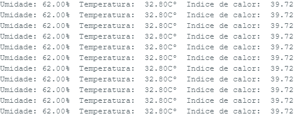

# ESP32-DHT11
Projeto usando o microcontrolador ESP32 e o sensor DHT11, usado para medir temperatura e umidade.

[Material de apoio utilizado](https://randomnerdtutorials.com/esp32-dht11-dht22-temperature-humidity-sensor-arduino-ide/)

### Materias necessários:
- Arduino IDE;
- ESP32 (Microcontrolador);
- DHT11 (Sensor de tempetatura e umidade);
- Resistor de 10k ohms (Não necessário se o sensor estiver no módulo);
- Protoboard (Ferramenta pra montar circuitos);
- Cabos para conexão.

### Processo de implementação:

#### 1º Montar o circuito 

#### 2º Instalar bibliotecas na Arduino IDE
Abra o seu Arduino IDE e vá em Sketch > Incluir Biblioteca > Gerenciar Bibliotecas. O Gerenciador de Bibliotecas deve abrir.

#### DHT sensor library
#### Adafruit Unified Sensor

#### 3º Verificar e compilar o código
Verifica a placa e a porta se estão corretamente selecionadas na IDE.
Após usar a verificação da IDE para localizar possível erros durante a implementação do códigos.

Como tudo funcionando corretamente agora basta carregar o código pra o microcontrolador, basta enviar o arquivo pela IDE e depois de compilar aperta o botão de Boot no ESP32.

## Resultados obtidos
Com tudo certo abrindo o monitor serial e verificando a taxa de transmição de 9600 baund são exibidos os valores de umidade, temperatura e o índice de calor.

Caso tenho gostado do projeto considere deixa uma estrela e me conecte no [Linkedin](https://www.linkedin.com/in/iorifernando/)
